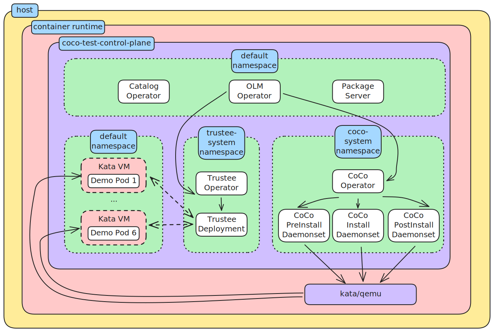

# Confidential Containers Hands-On

This repository provides an automated setup to get started testing [confidential containers](https://confidentialcontainers.org/) with [kind](https://kind.sigs.k8s.io/) and [codespaces](https://docs.github.com/en/codespaces). It includes pre-configured cluster configurations, operator deployments, and demo workloads to help you quickly explore confidential containers technology in a local development environment.

## Quickstart

To get started quickly, fork this repository and create a codespaces instance. In a few short moments you should be able to run the setup script (./start-demo) in the new codespace. From there you can install the necessary components all at once by selecting `Full Send!` or step by step.

If you don't have access to remote codespaces, this demonstration can be run locally as well using VSCode, the [Dev Containers extension](https://marketplace.visualstudio.com/items?itemName=ms-vscode-remote.remote-containers), and a container runtime. Just make sure that SELinux is not enabled.

## Overview

The general process for this demonstration is:
* Setup Cluster Prerequisites
  * [Operator Lifecycle Manager](https://github.com/operator-framework/operator-lifecycle-manager)
* Setup the confidential container runtime
  * [Confidential Containers Operator](https://github.com/confidential-containers/operator)
* Setup the trustee key broker services
  * [Trustee Operator](https://github.com/confidential-containers/trustee-operator)
* Install several (6) demo pods to demonstrate policy and secret management.

## Architecture



## Install Overview


## Demo Overview

### Demo 1: Alternative Runtime

Demonstrates that a runtime other than containerd can successfully provision a workload.

* You can investigate the workloads from the perspective of the node: 

  `kubectl debug node/coco-test-control-plane -it --image=busybox`

* Exploring the containerd runtime configuration at `/host/opt/kata/containerd/config.d/kata-deploy.toml` you will see that our runtimeclass (qemu-coco-dev) is being configured here `/opt/kata/share/defaults/kata-containers/configuration-qemu-coco-dev.toml`

* To enable debug mode and explore the kata machine add these two lines to `configuration-qemu-coco-dev.toml`

  ```
  debug_console = true
  debug_console_vport = 1026
  ```
  Once those fields have been added, you can exec into any **new** kata containers with:

  ```
  chroot /host
  /opt/kata/bin/kata-runtime exec {sandbox-id} <- gathered from `ps -ef | grep qemu`
  ```

### Demo 2: Runtime Policy

Demonstrates that runtime policy can be passed through annotations to do things like prevent remote execution. The first command below should work, while the second will fail.

```
kubectl exec -it coco-demo-01 -- echo "Container Command Successful"
kubectl exec -it coco-demo-01 -- echo "Container Command Successful"
```

You can explore the [initdata spec](https://github.com/confidential-containers/trustee/blob/162c620fd9bcd8d6db4bb5b0a5944932a160e89f/kbs/docs/initdata.md) or the [kata-agent-policy spec](https://github.com/kata-containers/kata-containers/blob/main/docs/how-to/how-to-use-the-kata-agent-policy.md) to create your own policies.

### Demo 3: Attestation

Demonstrates that metadata is leveraged for attestation with the attestation server.

Follow trustee's logs to confirm attestation `kubectl logs -n trustee-system deployment/trustee-deployment`

If you'd like to see more output, uncomment the following lines from `kbsconfig-sample.yaml` in the `trustee-config` directory and reapply it.

  ```
  KbsEnvVars:
    RUST_LOG: debug
  ```

### Demo 4: Confidential Data Hub

Demonstrates that a workload can call a local service to request information from the confidential data hub.

This demo leverages the `kbs-client` to load data into trustee. The binary is already loaded into your path so you can explore its functionality with `kbs-client --help`. You'll need these three pieces of information to do anything meaningful:

  ```
	KBS_HOST=$(kubectl get nodes -o jsonpath='{.items[0].status.addresses[?(@.type=="InternalIP")].address}' -n trustee-system)
	KBS_PORT=$(kubectl get svc kbs-service -o jsonpath='{.spec.ports[0].nodePort}' -n trustee-system)
	KBS_PRIVATE_KEY="/tmp/kbs.pem"
  ```

### Demo 5: Secret Management

Demonstrates that you can pull secrets when the right policy is enabled.

In this example the local `confidential data hub` api is called to obtain a secret. As we can see in the demo's manifest, the workload is trying to obtain our secret value: `Super Secret Value`

  `wget -O- http://127.0.0.1:8006/cdh/resource/default/secret/1; sleep infinity`

Confirm the log is correct with: `kubectl logs -n default coco-demo-05`
  

### Demo 6: Sealed Secrets

Demonstrates that you can use sealed secrets as a mechanism to keep your secrets within your trusted compute boundary.

Leveraging the Kubernetes Secret API to store secrets would invalidate much of the precaution Confidential Containers seek. Therefore Sealed Secrets are available to any given workload as environment variables or volumes.

In this final demo workload, both methods are used to access a kubernetes secret (`sealed-secret`) that simply acts as a pointer to our kbs secret.

Decoding the kubernetes secret (`kubectl get secrets/sealed-secret --template={{.data.secret}} | base64 -d`) will reveal this format `sealed.fakejwsheader.${ENCODED_STRING}.fakesignature.

Decoding the encoded string (`kubectl get secrets/sealed-secret --template={{.data.secret}} | base64 -d | cut -d"." -f3 | base64 -d`) will show us the pointer format. Something like this:

```
{
  "version": "0.1.0",
  "type": "vault",
  "name": "kbs:///default/secret/1",
  "provider": "kbs",
  "provider_settings": {},
  "annotations": {}
}
```

Thankfully we have also included a tool that will generate this information `secret`.

Example: `secret seal vault --resource-uri default/secret/1 --provider kbs`

## Included Tools

* [docker](https://docs.docker.com/reference/cli/docker/?_gl=1*875gcq*_gcl_au*ODc5OTQ1NDA5LjE3NjAzNjI0Mjg.*_ga*MTcyNDQxODM1MS4xNzU5NzY0NTQx*_ga_XJWPQMJYHQ*czE3NjA0NzEyMzckbzEwJGcxJHQxNzYwNDcxMjQ4JGo0OSRsMCRoMA..)
* [kind](https://kind.sigs.k8s.io/)
* [kubectl](https://kubernetes.io/docs/reference/kubectl/)
* [k9s](https://github.com/derailed/k9s)
* [kbs-client](https://github.com/confidential-containers/trustee/pkgs/container/staged-images%2Fkbs-client)
* [kata-guest-components](https://github.com/confidential-containers/guest-components)

## Notes

The original inspiration for this content is [here](https://confidentialcontainers.org/blog/2024/12/03/confidential-containers-without-confidential-hardware/)

As the above article implies, this configuration is **not** truly confidential, but merely for experimentation.